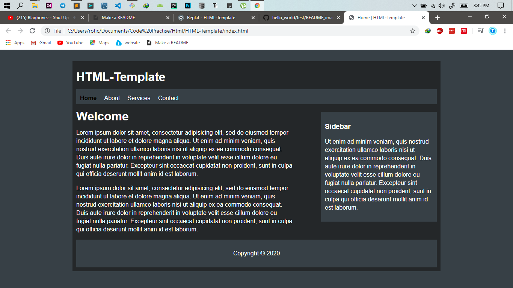
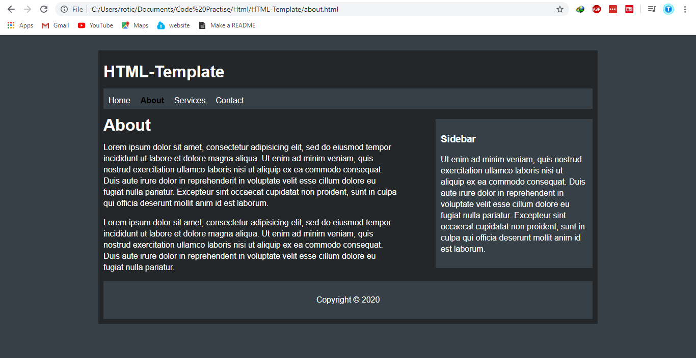
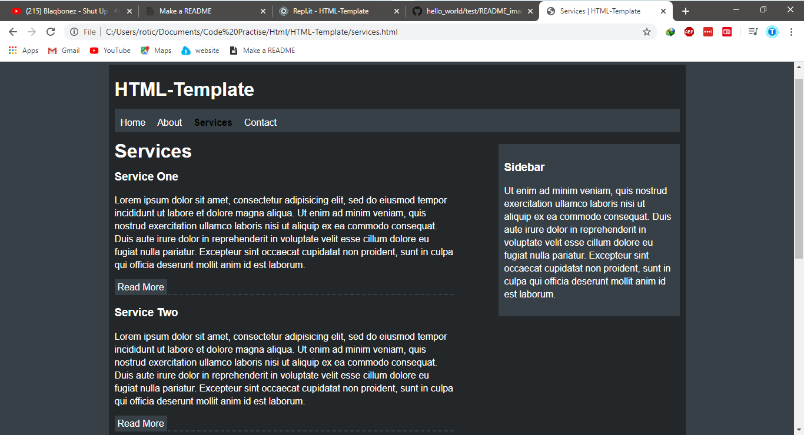
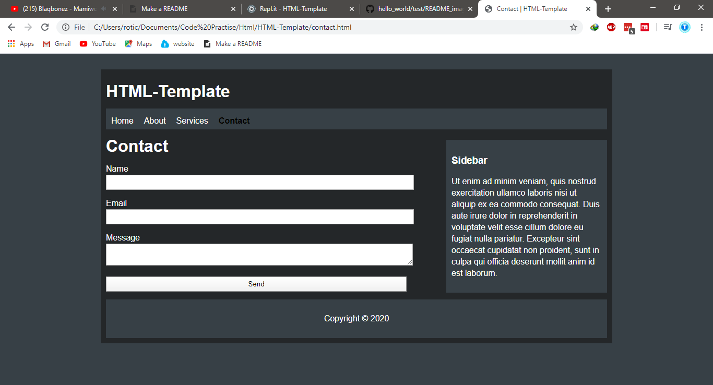

# HTML-Template

HTML-Template is a simple websited created using HTML and CSS.

## Demo

Here is a link for a live demo [HTML_Template](https://HTML-Template--rotichtonnytonn.repl.co).

## Home
Here is a screenshot of how a home page would look like.

## About
Here is a screenshot of how about page would look like.

## Services
Here is a screenshot of how services page would look like.

## Contact
Here is a screenshot of how a contact page would look like.

## Contributing
Pull requests are welcome. For major changes, please open an issue first to discuss what you would like to change.

Please make sure to update tests as appropriate.
